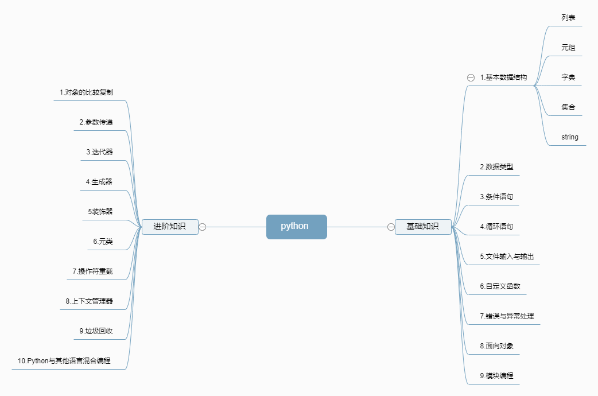

## 一、Python知识图谱



## 二、数据结构

### 1.列表（list）和元组（tuple）

列表和元组，都是**一个可以放置任意数据类型的有序集合**。

```python
>>> lis = [1,2,3,"string",[1,2,4]]
>>> lis
[1, 2, 3, 'string', [1, 2, 4]]
>>> tup = (1,2,'string')
>>> tup
(1, 2, 'string')
>>>
```

两者之间的区别：

- **列表是动态的**，长度大小不固定，可以随意地增加、删减或者改变元素（mutable）。
- **而元组是静态的**，长度大小固定，无法增加删减或者改变（immutable）。

```python
>>> lis[2] = 4
>>> lis
[1, 2, 4, 'string', [1, 2, 4]]
>>> tup[1] = 3
Traceback (most recent call last):
  File "<stdin>", line 1, in <module>
TypeError: 'tuple' object does not support item assignment
>>>
```

当我们试图改变元组内的值时，程序抛出异常。如果当我们需要改变元组内的值时，就只能重新开辟一块内存，创建新的元组了。

联系;

**Python 中的列表和元组都支持负数索引**，-1 表示最后一个元素，-2 表示倒数第二个元素，以此类推。

```python
>>> lis[-1]
[1, 2, 4]
>>> lis[-2]
'string'
>>>
```

**列表和元组都支持切片操作**：

```python
>>> lis[0:3]
[1, 2, 4]
>>>
```

列表和元组都**可以随意嵌套**：

两者也可以通过 list() 和 tuple() 函数相互转换：

### 2.字典（dict）和集合（set）

字典是一系列由键（key）和值（value）配对组成的元素的集合，在 Python3.7+，字典被确定为有序（注意：在 3.6 中，字典有序是一个 implementation detail，在 3.7 才正式成为语言特性，因此 3.6 中无法 100% 确保其有序性），而 3.6 之前是无序的，其长度大小可变，元素可以任意地删减和改变。

而集合和字典基本相同，唯一的区别，就是集合没有键和值的配对，是一系列无序的、唯一的元素组合。

字典构造方法：

```python
>>> d1 = {'name':'jason','age':20}
>>> d2 = dict({'name':'jason','age':20})
>>> d3 = dict([('name','jason'),('age',20)])
>>> d4 = dict(name = 'jason',age = 20)
>>> d1 == d2 == d3 == d4
True
```

集合的构造方法：

```python
>>> s1 = {1, 2, 3}
>>> s2 = set([1, 2, 3])
>>> s1 == s2
True
```

Python 中字典和集合，无论是键还是值，都可以是混合类型。

字典访问可以直接索引键，如果不存在，就会抛出异常；也可以使用 get(key, default) 函数来进行索引。如果键不存在，调用 get() 函数可以返回一个默认值。

**集合并不支持索引操作，因为集合本质上是一个哈希表，和列表不一样**。

想要判断一个元素在不在字典或集合内，我们可以用 value in dict/set 来判断。

除了创建和访问，字典和集合也同样支持增加、删除、更新等操作

### 3.字符串（string）

字符串是由独立字符组成的一个序列，通常包含在单引号（''）双引号（""）或者三引号之中（''' '''或""" """，两者一样）

```python
>>> s1 = 'hello'
>>> s2 = "hello"
>>> s3 = """hello"""
>>> s1 == s2 == s3
True
```

Python 也支持转义字符。所谓的转义字符，就是用反斜杠开头的字符串，来表示一些特定意义的字符。

| 转义字符 | 说明       |
| -------- | ---------- |
| \newline | 接到下一行 |
| \\\      | 表示\      |
| \\'      | 表示单引号 |
| \\"      | 表示双引号 |
| \n       | 换行       |
| \t       | 横向制表符 |
| \b       | 退格       |
| \v       | 纵向制表符 |

可以把字符串想象成一个由单个字符组成的数组，所以，Python 的字符串同样支持索引，切片和遍历等等操作。

Python 的字符串是不可变的（immutable）。Python 中字符串的改变，通常只能通过创建新的字符串来完成。

## 二、输入与输出

### 1.基本输入输出

input() 函数暂停程序运行，同时等待键盘输入；直到回车被按下，函数的参数即为提示语，输入的类型永远是字符串型（str）。

把 str 强制转换为 int 请用 int()，转为浮点数请用 float()。而在生产环境中使用强制转换时，请记得加上 try except。

Python 对 int 类型没有最大限制（相比之下， C++ 的 int 最大为 2147483647，超过这个数字会产生溢出），但是对 float 类型依然有精度限制。

### 2.文件输入输出

我们先要用 open() 函数拿到文件的指针。其中，第一个参数指定文件位置（相对位置或者绝对位置）；第二个参数，如果是 `'r'`表示读取，如果是`'w'` 则表示写入，当然也可以用 `'rw'` ，表示读写都要。a 则是一个不太常用（但也很有用）的参数，表示追加（append），这样打开的文件，如果需要写入，会从原始文件的最末尾开始写入。

我们可以给 read 指定参数 size ，用来表示读取的最大长度。还可以通过 readline() 函数，每次读取一行，这种做法常用于数据挖掘（Data Mining）中的数据清洗，在写一些小的程序时非常轻便。如果每行之间没有关联，这种做法也可以降低内存的压力。而 write() 函数，可以把参数中的字符串输出到文件中，也很容易理解。

open() 函数对应于 close() 函数，也就是说，如果你打开了文件，在完成读取任务后，就应该立刻关掉它。而如果你使用了 with 语句，就不需要显式调用 close()。在 with 的语境下任务执行完毕后，close() 函数会被自动调用，代码也简洁很多。

## 三、条件与循环

### 1.条件语句

```python
if condition_1:
    statement_1
elif condition_2:
    statement_2
...
elif condition_i:
    statement_i
else:
    statement_n
```

if 语句是可以单独使用的，但 elif、else 都必须和 if 成对使用。

省略的写法：

```python
if s: # s is a string
    ...
if l: # l is a list
    ...
if i: # i is an int
    ...
... 

```

判断条件的省略用法：

| 数据类型            | 结果                    |
| ------------------- | ----------------------- |
| String              | 空字符解析为false       |
| int                 | 0解析为false            |
| bool                | True,false              |
| list/tuple/dict/set | Iterable为空解析为false |
| object              | None解析为false         |

### 2.循环语句

#### for

Python 中的数据结构只要是可迭代的（iterable），比如列表、集合等等，那么都可以通过下面这种方式遍历：

```python
for item in <iterable>:
    ...

```

这里需要单独强调一下字典。字典本身只有键是可迭代的，如果我们要遍历它的值或者是键值对，就需要通过其内置的函数 values() 或者 items() 实现。其中，values() 返回字典的值的集合，items() 返回键值对的集合。

通过集合中的索引来遍历元素：

我们通常通过 range() 这个函数，拿到索引，再去遍历访问集合中的元素。

```python
l = [1, 2, 3, 4, 5, 6, 7]
for index in range(0, len(l)):
    if index < 5:
        print(l[index])      
```

当我们同时需要索引和元素时，还有一种更简洁的方式，那就是通过 Python 内置的函数 enumerate()。用它来遍历集合，不仅返回每个元素，并且还返回其对应的索引，

```python
l = [1, 2, 3, 4, 5, 6, 7]
for index, item in enumerate(l):
    if index < 5:
        print(item)  
```

在循环语句中，我们还常常搭配 continue 和 break 一起使用。所谓 continue，就是让程序跳过当前这层循环，继续执行下面的循环；而 break 则是指完全跳出所在的整个循环体。在循环中适当加入 continue 和 break，往往能使程序更加简洁、易读。

#### while

while 循环，原理也是一样的。它表示当 condition 满足时，一直重复循环内部的操作，直到 condition 不再满足，就跳出循环体。

```python
while conditon:
    ...
```

## 四、异常处理

### 1.错误与异常

错误：一种是语法错误，另一种是异常。

所谓语法错误，你应该很清楚，也就是你写的代码不符合编程规范，无法被识别与执行；

而异常则是指程序的语法正确，也可以被执行，但在执行过程中遇到了错误，抛出了异常。

### 2.如何处理异常

使用try expect，

```python
try:
    s = input('please enter two numbers separated by comma: ')
    num1 = int(s.split(',')[0].strip())
    num2 = int(s.split(',')[1].strip())
    ...
except ValueError as err:
    print('Value Error: {}'.format(err))
except IndexError as err:
    print('Index Error: {}'.format(err))
except Exception as err:
    print('Other error: {}'.format(err))
 
print('continue')
...
```

### 3.用户自定义异常

```python
class MyInputError(Exception):
    """Exception raised when there're errors in input"""
    def __init__(self, value): # 自定义异常类型的初始化
        self.value = value
    def __str__(self): # 自定义异常类型的 string 表达形式
        return ("{} is invalid input".format(repr(self.value)))
    
try:
    raise MyInputError(1) # 抛出 MyInputError 这个异常
except MyInputError as err:
    print('error: {}'.format(err))
```

## 五、函数基础

### 1.函数基础

定义如下：

```python
def func(param):
    ...
```

参数可以有默认值：

```python
def func(param = 0):
    ...
```

Python 不用考虑输入的数据类型，而是将其交给具体的代码去判断执行，同样的一个函数，可以同时应用在整型、列表、字符串等等的操作中。

在编程语言中，我们把这种行为称为**多态**。这也是 Python 和其他语言，比如 Java、C 等很大的一个不同点。当然，Python 这种方便的特性，在实际使用中也会带来诸多问题。因此，必要时请你在开头加上数据的类型检查。

### 2.函数嵌套

Python 函数的另一大特性，是 Python 支持函数的嵌套。所谓的函数嵌套，就是指函数里面又有函数，比如：

```python
def f1():
    print('hello')
    def f2():
        print('world')
    f2()
f1()
 
```

函数的嵌套，主要有下面两个方面的作用：

第一，函数的嵌套能够保证内部函数的隐私。内部函数只能被外部函数所调用和访问，不会暴露在全局作用域，因此，如果你的函数内部有一些隐私数据（比如数据库的用户、密码等），不想暴露在外，那你就可以使用函数的的嵌套，将其封装在内部函数中，只通过外部函数来访问。

第二，合理的使用函数嵌套，能够提高程序的运行效率。

### 3.闭包

闭包其实和刚刚讲的嵌套函数类似，不同的是，这里外部函数返回的是一个函数，而不是一个具体的值。返回的函数通常赋于一个变量，这个变量可以在后面被继续执行调用。

```python
def nth_power(exponent):
    def exponent_of(base):
        return base ** exponent
    return exponent_of # 返回值是 exponent_of 函数
 
square = nth_power(2) # 计算一个数的平方
cube = nth_power(3) # 计算一个数的立方 
square
# 输出
<function __main__.nth_power.<locals>.exponent(base)>
 
cube
# 输出
<function __main__.nth_power.<locals>.exponent(base)>
 
print(square(2))  # 计算 2 的平方
print(cube(2)) # 计算 2 的立方
# 输出
4 # 2^2
8 # 2^3
```

作用：

1.提高代码可读性

2.闭包常常和装饰器（decorator）一起使用。

## 六、匿名函数

### 1.匿名函数基础

首先，什么是匿名函数呢？以下是匿名函数的格式：

```python
lambda argument1, argument2,... argumentN : expression
```

我们可以看到，匿名函数的关键字是 lambda，之后是一系列的参数，然后用冒号隔开，最后则是由这些参数组成的表达式。我们通过几个例子看一下它的用法：

```python
square = lambda x: x**2
square(3)
```

这里的匿名函数只输入一个参数 x，输出则是输入 x 的平方。因此当输入是 3 时，输出便是 9。如果把这个匿名函数写成常规函数的形式，则是下面这样：

```python
def square(x):
    return x**2
square(3)
```

可以看到，匿名函数 lambda 和常规函数一样，返回的都是一个函数对象（function object）

**第一，lambda 是一个表达式（expression），并不是一个语句（statement）**。

- 所谓的表达式，就是用一系列“公式”去表达一个东西，比如`x + 2`、 `x**2`等等；
- 而所谓的语句，则一定是完成了某些功能，比如赋值语句`x = 1`完成了赋值，print 语句`print(x)`完成了打印，条件语句 `if x < 0:`完成了选择功能等等。

因此，lambda 可以用在一些常规函数 def 不能用的地方，比如，lambda 可以用在列表内部，而常规函数却不能：

```python
[(lambda x: x*x)(x) for x in range(10)]
# 输出
[0, 1, 4, 9, 16, 25, 36, 49, 64, 81]
```

再比如，lambda 可以被用作某些函数的参数，而常规函数 def 也不能：

```python
l = [(1, 20), (3, 0), (9, 10), (2, -1)]
l.sort(key=lambda x: x[1]) # 按列表中元祖的第二个元素排序
print(l)
# 输出
[(2, -1), (3, 0), (9, 10), (1, 20)]
```

常规函数 def 必须通过其函数名被调用，因此必须首先被定义。但是作为一个表达式的 lambda，返回的函数对象就不需要名字了。

**第二，lambda 的主体是只有一行的简单表达式，并不能扩展成一个多行的代码块。**

这其实是出于设计的考虑。Python 之所以发明 lambda，就是为了让它和常规函数各司其职：lambda 专注于简单的任务，而常规函数则负责更复杂的多行逻辑。

匿名函数通常的使用场景是：程序中需要使用一个函数完成一个简单的功能，并且该函数只调用一次。

### 2.Python 函数式编程

所谓函数式编程，是指代码中每一块都是不可变的（immutable），都由纯函数（pure function）的形式组成。这里的纯函数，是指函数本身相互独立、互不影响，对于相同的输入，总会有相同的输出，没有任何副作用。

举个很简单的例子，比如对于一个列表，我想让列表中的元素值都变为原来的两倍，我们可以写成下面的形式：

```python
def multiply_2(l):
    for index in range(0, len(l)):
        l[index] *= 2
    return l
```

这段代码就不是一个纯函数的形式，因为列表中元素的值被改变了，如果我多次调用 multiply_2() 这个函数，那么每次得到的结果都不一样。要想让它成为一个纯函数的形式，就得写成下面这种形式，重新创建一个新的列表并返回。

```python
def multiply_2_pure(l):
    new_list = []
    for item in l:
        new_list.append(item * 2)
    return new_list
```

函数式编程的优点，主要在于其纯函数和不可变的特性使程序更加健壮，易于调试（debug）和测试；缺点主要在于限制多，难写。当然，Python 不同于一些语言（比如 Scala），它并不是一门函数式编程语言，不过，Python 也提供了一些函数式编程的特性，值得我们了解和学习。

Python 主要提供了这么几个函数：map()、filter() 和 reduce()，通常结合匿名函数 lambda 一起使用。这些都是你需要掌握的东西，接下来我逐一介绍。

首先是 map(function, iterable) 函数，前面的例子提到过，它表示，对 iterable 中的每个元素，都运用 function 这个函数，最后返回一个新的可遍历的集合。比如刚才列表的例子，要对列表中的每个元素乘以 2，那么用 map 就可以表示为下面这样：

```python
l = [1, 2, 3, 4, 5]
new_list = map(lambda x: x * 2, l) # [2， 4， 6， 8， 10]
```

我们可以以 map() 函数为例，看一下 Python 提供的函数式编程接口的性能。还是同样的列表例子，它还可以用 for 循环和 list comprehension（目前没有统一中文叫法，你也可以直译为列表理解等）实现，我们来比较一下它们的速度：

```python
python3 -mtimeit -s'xs=range(1000000)' 'map(lambda x: x*2, xs)'
2000000 loops, best of 5: 171 nsec per loop
 
python3 -mtimeit -s'xs=range(1000000)' '[x * 2 for x in xs]'
5 loops, best of 5: 62.9 msec per loop
 
python3 -mtimeit -s'xs=range(1000000)' 'l = []' 'for i in xs: l.append(i * 2)'
5 loops, best of 5: 92.7 msec per loop
```

你可以看到，map() 是最快的。因为 map() 函数直接由 C 语言写的，运行时不需要通过 Python 解释器间接调用，并且内部做了诸多优化，所以运行速度最快。

接下来来看 filter(function, iterable) 函数，它和 map 函数类似，function 同样表示一个函数对象。filter() 函数表示对 iterable 中的每个元素，都使用 function 判断，并返回 True 或者 False，最后将返回 True 的元素组成一个新的可遍历的集合。

举个例子，比如我要返回一个列表中的所有偶数，可以写成下面这样：

```python
l = [1, 2, 3, 4, 5]
new_list = filter(lambda x: x % 2 == 0, l) # [2, 4]
```

最后我们来看 reduce(function, iterable) 函数，它通常用来对一个集合做一些累积操作。

function 同样是一个函数对象，规定它有两个参数，表示对 iterable 中的每个元素以及上一次调用后的结果，运用 function 进行计算，所以最后返回的是一个单独的数值。

举个例子，我想要计算某个列表元素的乘积，就可以用 reduce() 函数来表示：

```python
l = [1, 2, 3, 4, 5]
product = reduce(lambda x, y: x * y, l) # 1*2*3*4*5 = 120
```

当然，类似的，filter() 和 reduce() 的功能，也可以用 for 循环或者 list comprehension 来实现。

通常来说，在我们想对集合中的元素进行一些操作时，如果操作非常简单，比如相加、累积这种，那么我们优先考虑 map()、filter()、reduce() 这类或者 list comprehension 的形式。至于这两种方式的选择：

- 在数据量非常多的情况下，比如机器学习的应用，那我们一般更倾向于函数式编程的表示，因为效率更高；
- 在数据量不多的情况下，并且你想要程序更加 Pythonic 的话，那么 list comprehension 也不失为一个好选择。

不过，如果你要对集合中的元素，做一些比较复杂的操作，那么，考虑到代码的可读性，我们通常会使用 for 循环，这样更加清晰明了。

## 七、面向对象

**类，一群有着相同属性和函数的对象的集合。**

**init**表示构造函数，意即一个对象生成时会被自动调用的函数。如果一个属性以 __ （注意，此处有两个 _） 开头，我们就默认这个属性是私有属性。私有属性，是指不希望在类的函数之外的地方被访问和修改的属性。

- 如何在一个类中定义一些常量，每个对象都可以方便访问这些常量而不用重新构造？

  在 Python 的类里，你只需要和函数并列地声明并赋值，就可以实现这一点。

- 如果一个函数不涉及到访问修改这个类的属性，而放到类外面有点不恰当，怎么做才能更优雅呢？

  使用类函数、成员函数和静态函数。前两者产生的影响是动态的，能够访问或者修改对象的属性；而静态函数则与类没有什么关联，最明显的特征便是，静态函数的第一个参数没有任何特殊性。

  具体来看这几种函数。一般而言，静态函数可以用来做一些简单独立的任务，既方便测试，也能优化代码结构。静态函数还可以通过在函数前一行加上 @staticmethod 来表示，代码中也有相应的示例。这其实使用了装饰器的概念。

  而类函数的第一个参数一般为 cls，表示必须传一个类进来。类函数最常用的功能是实现不同的 **init** 构造函数。类似的，类函数需要装饰器 @classmethod 来声明。

  成员函数则是我们最正常的类的函数，它不需要任何装饰器声明，第一个参数 self 代表当前对象的引用，可以通过此函数，来实现想要的查询 / 修改类的属性等功能。

- 既然类是一群相似的对象的集合，那么可不可以是一群相似的类的集合呢？

  **继承**

  类的继承，顾名思义，指的是一个类既拥有另一个类的特征，也拥有不同于另一个类的独特特征。在这里的第一个类叫做子类，另一个叫做父类，特征其实就是类的属性和函数。

  首先需要注意的是构造函数。每个类都有构造函数，继承类在生成对象的时候，是不会自动调用父类的构造函数的，因此你必须在 **init**() 函数中显式调用父类的构造函数。它们的执行顺序是 子类的构造函数 -> 父类的构造函数。

  抽象类是一种特殊的类，它生下来就是作为父类存在的，一旦对象化就会报错。同样，抽象函数定义在抽象类之中，子类必须重写该函数才能使用。相应的抽象函数，则是使用装饰器 @abstractmethod 来表示。

## 八、模块化编程

调用子目录的模块时，只需要使用 `.` 代替 `/` 来表示子目录，例如：utils.utils 表示 utils 子文件夹下的 utils.py 模块就行。

那如果我们想调用上层目录呢？注意，`sys.path.append("..")` 表示将当前程序所在位置**向上**提了一级，之后就能调用 utils 的模块了。

同时要注意一点，import 同一个模块只会被执行一次，这样就可以防止重复导入模块出现问题。

最后我想再提一下版本区别。你可能在许多教程中看到过这样的要求：我们还需要在模块所在的文件夹新建一个 `__init__.py`，内容可以为空，也可以用来表述包对外暴露的模块接口。不过，事实上，这是 Python 2 的规范。在 Python 3 规范中，`__init__.py` 并不是必须的。

通常，一个 Python 文件在运行的时候，都会有一个运行时位置，最开始时即为这个文件所在的文件夹。当然，这个运行路径以后可以被改变。运行 `sys.path.append("..")` ，则可以改变当前 Python 解释器的位置。

神奇的 if \_\_name\_\_ == '\_\_main\_\_'：

import 在导入文件的时候，会自动把所有暴露在外面的代码全都执行一遍。因此，如果你要把一个东西封装成模块，又想让它可以执行的话，你必须将要执行的代码放在 `if __name__ == '__main__'`下面。
