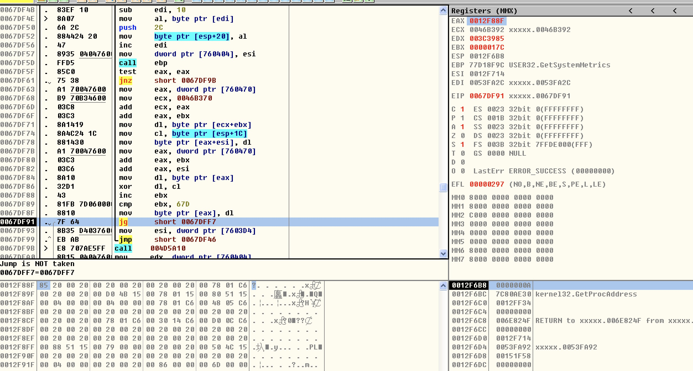
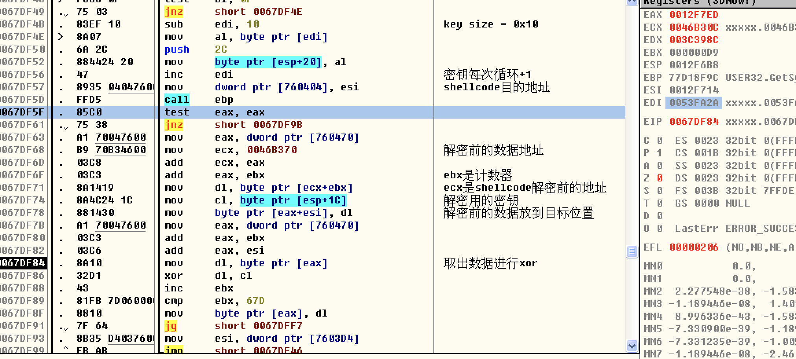
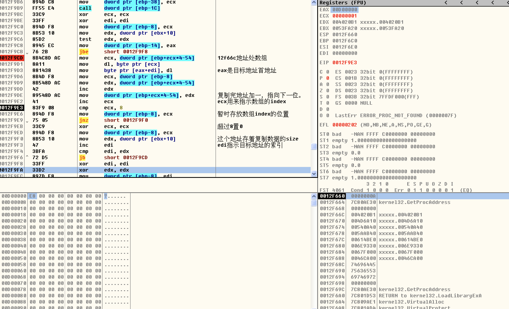
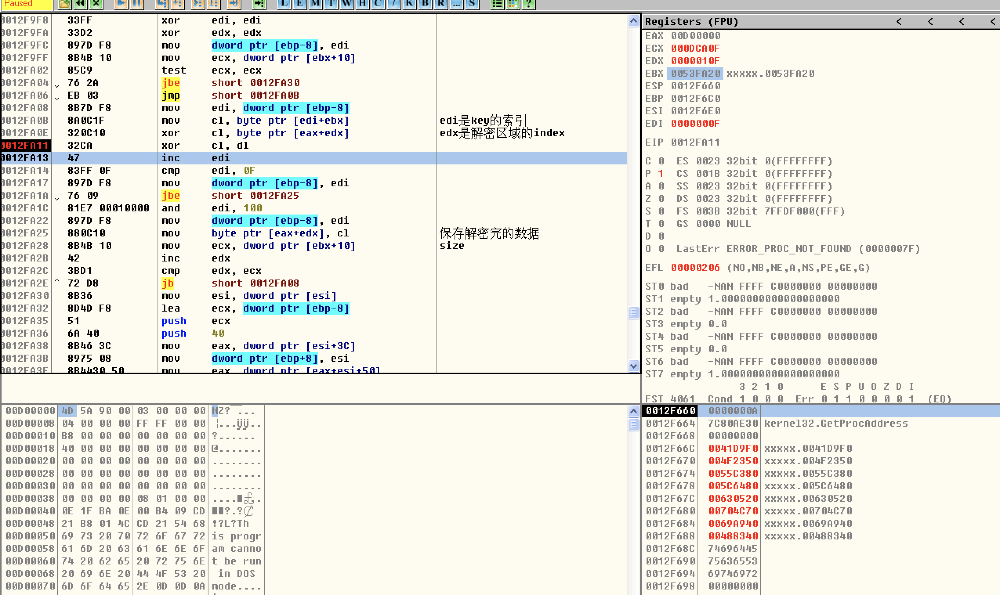

## 目标

主要分析木马的解密过程。

## 分析过程

使用ollydbg利用命令`bp VirtualAlloc`首先在VirtualAlloc处下断点，第一次是个size=0xE0，暂时忽略，第二次size=0xDCA00，看起来像是一个pe文件的大小了，调用地址也比较奇怪，是栈空间的地址，有此可以断定在此之前一定还有另一个解密过程，把代码揭秘到栈空间去执行。

先去看它第一次的解密过程，把它返回地址(0x12f88f)和数据(0x85)记下来，重新运行该样本，等它断在入口点时，在这个栈地址上下硬件断点，等这地方的数据成为0x85时再观察，来到了0x67DF8F地址处，如图所示：



接下来就是分析这片的代码干了什么事，经过分析后，我添加了注释，如下图所示：



其实就是简单的解密操作，源数据地址在0x46B370，大小为0x67D，解密密钥地址为0x53FA20,大小为0x10字节，目标地址为0x12F714。

接下来分析第二个解密的地方，首先在分配完内存后，使用硬件断点找到解密代码的地方，在0x12f9d3地址处把数据复制进目标地址，然后在0x12fa25地址处解密，先分析复制数据区域的代码，如图所示：



    0012F66C   004020B1
    0012F670   004D6A10
    0012F674   00540A40
    0012F678   005AAB40
    0012F67C   00614BE0
    0012F680   006E9330
    0012F684   0067F000
    0012F688   0046CA00

经过分析复制的过程是这样的：将这八个地址的数据，每次循环各取出一字节，按顺序复制到目标缓冲区中。

接下来分析解密过程：



解密也是使用的0x53FA20地址处的密钥，密钥与数据xor运算后，又使用了数据的索引的低16位进行了一次xor运算得到揭秘结果，通过，通过MZ和PE的标志，由此我们推断这是个PE文件。

加载该PE文件的方式使用内存加载：为了描述清楚具体的加载方式我写了一个效果一样的加载器：

```c
#include <stdio.h>
#include <windows.h>

#define RELOC_32BIT_FIELD 3
#define RELOC_64BIT_FIELD 0xA

#ifdef _WIN64
#define RELOC_FIELD RELOC_64BIT_FIELD
typedef ULONG_PTR FIELD_PTR;
#else
#define RELOC_FIELD RELOC_32BIT_FIELD
#endif

typedef struct _BASE_RELOCATION_ENTRY {
    WORD Offset : 12;
    WORD Type : 4;
} BASE_RELOCATION_ENTRY;

BOOL repair_reloc(PIMAGE_NT_HEADERS nt, BYTE* image)
{
    BYTE* new_image_base = image;
    IMAGE_DATA_DIRECTORY reloc_dict = nt->OptionalHeader.DataDirectory[IMAGE_DIRECTORY_ENTRY_BASERELOC];
    if (reloc_dict.VirtualAddress == 0) {
        return FALSE;
    }
    PIMAGE_BASE_RELOCATION reloc = (PIMAGE_BASE_RELOCATION)(reloc_dict.VirtualAddress + image);
    while (reloc->VirtualAddress != 0)
    {
        DWORD page = reloc->VirtualAddress;
#ifdef _DEBUG
        printf("Page: %d\n", page);
#endif
        if (reloc->SizeOfBlock >= sizeof(IMAGE_BASE_RELOCATION))
        {
            size_t count = (reloc->SizeOfBlock - sizeof(IMAGE_BASE_RELOCATION)) / sizeof(WORD);
            BASE_RELOCATION_ENTRY* list = (BASE_RELOCATION_ENTRY*)(LPWORD)(reloc + 1);
#ifdef _DEBUG
            printf("Count:%d\n", count);
#endif
            for (size_t i = 0; i < count; i++)
            {
                if (list[i].Type & RELOC_FIELD)
                {
                    DWORD rva = list[i].Offset + page;
#ifdef _DEBUG
                    printf("RVA : %x\n",rva);
#endif
                    PULONG_PTR p = (PULONG_PTR)((LPBYTE)image + rva);
                    *p = ((*p) - nt->OptionalHeader.ImageBase) + new_image_base;
                }
            }
        }
        reloc = (PIMAGE_BASE_RELOCATION)((LPBYTE)reloc + reloc->SizeOfBlock);
    }
    return TRUE;
}

BOOL repair_imports(PIMAGE_NT_HEADERS nt, BYTE* image)
{
    IMAGE_DATA_DIRECTORY imp_dict = nt->OptionalHeader.DataDirectory[IMAGE_DIRECTORY_ENTRY_IMPORT];
    if (imp_dict.VirtualAddress == 0) {
        return FALSE;
    }
    PIMAGE_IMPORT_DESCRIPTOR imp_desc = (PIMAGE_IMPORT_DESCRIPTOR)(imp_dict.VirtualAddress + image);

    while (imp_desc->Name != NULL)
    {
        LPCSTR library_name = (LPCSTR)(imp_desc->Name + image);
        HMODULE library = LoadLibraryA(library_name);
#ifdef _DEBUG
        printf("Loading: %s \n", library_name);
#endif
        if (library)
        {
            PIMAGE_THUNK_DATA thunk = NULL;
            thunk = (PIMAGE_THUNK_DATA)(image + imp_desc->FirstThunk);

            while (thunk->u1.AddressOfData != NULL)
            {
                void* functionAddress = NULL;
                if (IMAGE_SNAP_BY_ORDINAL(thunk->u1.Ordinal))
                {
                    LPCSTR functionOrdinal = (LPCSTR)IMAGE_ORDINAL(thunk->u1.Ordinal);
                    functionAddress = GetProcAddress(library, functionOrdinal);
                }
                else
                {
                    PIMAGE_IMPORT_BY_NAME functionName = (PIMAGE_IMPORT_BY_NAME)(image + thunk->u1.AddressOfData);
                    functionAddress = GetProcAddress(library, functionName->Name);
                }
                thunk->u1.Function = functionAddress;
                ++thunk;
            }
        }

        imp_desc++;
    }
    return TRUE;
}

BOOL load_pe(BYTE* raw, int size, void** image_)
{
    PIMAGE_DOS_HEADER dos_header = (PIMAGE_DOS_HEADER)raw;
    PIMAGE_NT_HEADERS nt = (PIMAGE_NT_HEADERS)(raw + dos_header->e_lfanew);
    BYTE * image = (BYTE*)VirtualAlloc(NULL, nt->OptionalHeader.SizeOfImage, MEM_COMMIT | MEM_RESERVE, PAGE_EXECUTE_READWRITE);
    if (image == NULL)
    {
        printf("VirtualAlloc failed!");
        return FALSE;
    }
    printf("Image Alloc at %p", image);
    memcpy(image, raw, nt->OptionalHeader.SizeOfHeaders);

    // map sections
    PIMAGE_SECTION_HEADER section = IMAGE_FIRST_SECTION(nt);
    for (WORD i = 0; i < nt->FileHeader.NumberOfSections; i++)
    {
        memcpy((BYTE*)(image)+section[i].VirtualAddress, (BYTE*)(raw)+section[i].PointerToRawData, section[i].SizeOfRawData);
    }

    //reloc
    BOOL state = repair_reloc(nt, image);
    if (!state)
    {
        VirtualFree(image, 0, MEM_RELEASE);
        return state;
    }

    //import
    state = repair_imports(nt, image);
    if (!state)
    {
        VirtualFree(image, 0, MEM_RELEASE);
        return state;
    }

    *image_ = image;
    return TRUE;
}

BYTE* read_exe(const char* exe_path, int* size)
{
    HANDLE file_handle = CreateFileA(exe_path, GENERIC_READ, 0, NULL, OPEN_EXISTING, FILE_ATTRIBUTE_NORMAL, NULL);
    if (!file_handle || file_handle == INVALID_HANDLE_VALUE) {
        printf("open file failed");
        return NULL;
    }
    *size = GetFileSize(file_handle, NULL);
    if (*size == INVALID_FILE_SIZE) {
        CloseHandle(file_handle);
        return NULL;
    }
    //read the file
    BYTE* raw = VirtualAlloc(NULL, *size, MEM_COMMIT, PAGE_READWRITE);
    if (raw == NULL)
    {
        return NULL;
    }
    if (!ReadFile(file_handle, raw, *size, NULL, NULL)) {
        printf("[ERROR] Reading the file has failed!\n");
        VirtualFree(raw, 0, MEM_RELEASE);
        raw = NULL;
    }
    CloseHandle(file_handle);
    return raw;
}

BOOL run_exe(BYTE* raw, BYTE* image)
{
    PIMAGE_DOS_HEADER dos_header = (PIMAGE_DOS_HEADER)raw;
    PIMAGE_NT_HEADERS nt = (PIMAGE_NT_HEADERS)(raw + dos_header->e_lfanew);

    void* entry_point = nt->OptionalHeader.AddressOfEntryPoint + image;

    printf( "Entry Address: %p\n", entry_point);
    int (*exe_entry)() = (int(*)())entry_point;
    
    exe_entry();

    return TRUE;
}

int main(int argc, char *argv[])
{
    if (argc < 2)
    {
        printf("pe_load <exe_path>\t");
#ifdef _WIN64
        printf("64 bit version\n");
#else
        printf("32 bit version\n");
#endif
        return 0;
    }

    const char* exe_path = argv[1];
    int size = 0;
    BYTE* raw = read_exe(exe_path, &size);
    if (raw == NULL)
        return 0;
    void* image = NULL;
    BOOL state = load_pe(raw, size, &image);
    if (!state)
    {
        VirtualFree(raw, 0, MEM_RELEASE);
        return 0;
    }
    state = run_exe(raw, image);

    VirtualFree(raw, 0, MEM_RELEASE);
    VirtualFree(image, 0, MEM_RELEASE);
    return 0;
}
```